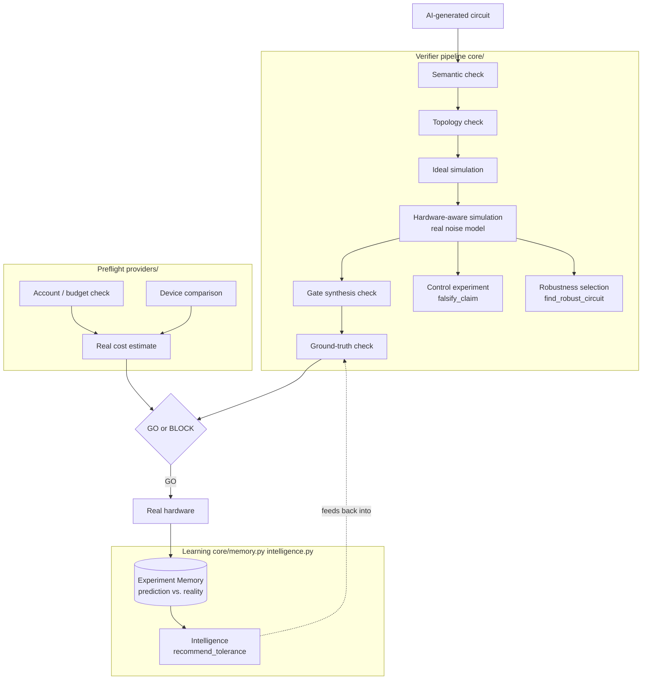

# quantum-verifier

A safety gate between an AI-generated quantum circuit and real quantum hardware. It checks whether a circuit is well-formed, whether it will survive real routing constraints, and — the flagship capability — whether a claimed result is actually distinguishable from what hardware noise alone would produce. It can do this even when you don't know the right answer in advance.

Companion project to [quantum-hardware-mcp](https://github.com/Lokesh-2025/quantum-hardware-mcp) — an open-source MCP server giving AI assistants live access to real quantum backends across IBM, IonQ, and AWS Braket. `quantum-verifier` carries over that server's general-purpose device and job tools, drops everything specific to our own research, and adds one thing nothing else in this space does: a mandatory correctness gate in front of real hardware spend.

| | |
|---|---|
| **Tools** | 35 |
| **Tests** | 41, all passing |
| **Real bugs caught before they cost anything** | 4 |
| **Real hardware confirmed** | 3/3 circuits, Forte-Enterprise-1 |
| **License** | MIT |

---

## Architecture



---

## Why this exists

Circuits that *look* correct — parse fine, run without error, produce plausible numbers — can still be wrong in ways that never throw an exception. Wrong bit ordering. Wrong native gate family. A silently inflated gate count that changes what actually runs on the chip. None of these crash. All of them are only caught by deliberately checking against ground truth.

This project generalizes that lesson into a standalone check: instead of trusting a circuit's own claim about what it does, verify it — simulate it ideally, simulate it against the real target device's actual noise behavior, and check whether the claimed result genuinely survives contact with that noise.

---

## What we found using it on a real experiment

This isn't a demo built to look good — it caught a real bug in its own already-shipped results the first time it was used for real.

Before ever submitting a pre-registered experiment (characterizing angle-dependent error on IonQ's Forte-class hardware) to real hardware, its own rule requires a free-simulator dry run first. That dry run came back statistically shaky — not broken, just not clean. Chasing it down surfaced a real bug: Qiskit's transpiler had no direct translation between the standard `rzz` gate and IonQ's native `zz` gate, so it was silently falling back to expensive, noisy general synthesis — turning **1 logical two-qubit gate into 2 native gates plus ~39 extra single-qubit gates**.

That bug wasn't limited to the new experiment. It had already been quietly affecting results shipped in this repo's own test suite — the "isolated entangling effect" reported for a real research circuit moved from **0.0352 to 0.0735** once fixed, meaning the original number had been masking roughly half the real signal.

Fixing it surfaced two more real issues in the same code path:
- The bare `"simulator"` target silently defaults to IonQ's retired Aria-era gate family instead of the modern one used by Forte-class hardware.
- IonQ's native two-qubit gate is only valid for rotations up to a quarter turn — larger logical rotations need an exact multi-gate decomposition, not a naive 1:1 conversion.

All three are now fixed, and the fix itself became a permanent, general check (`gate_synthesis_check`) rather than a one-off patch — so the next circuit that hits this class of bug gets caught automatically. The angle-error experiment's own safety check still wasn't fully clean right after the fix — correctly, it stayed blocked from real hardware rather than proceeding on an unexplained discrepancy. That discrepancy is now resolved (see below) — it turned out to be a real, separate, interesting finding, not a lingering bug.

**First real hardware confirmation.** A separate experiment — a graded series of entangling search circuits on IonQ, looking for a specific number in Pascal's Triangle — went through the full pipeline this project's discipline requires: checked, cost-estimated, budget-verified, submitted for real, and confirmed. **All three circuits found the right answer on real Forte-Enterprise-1 hardware.** Along the way, this same discipline caught two more real, separate problems before they cost anything:
- An API key silently pointed at the wrong, unfunded organization for an unknown period, while the real funded one had never even had a key generated.
- A cost estimate quietly wrong by roughly 2x, because two other functions (`estimate_ionq_cost`, `estimate_ionq_gates`) had the same missing gate-decomposition fix as above, just not yet applied there.

Both fixed, both now covered by real tests. **That's 4 real, distinct bugs this tool caught before they cost real money or produced a wrong published result** — not a demo running smoothly, an actual safety net catching actual failures.

**The angle-error discrepancy, resolved.** The residual issue blocking that first experiment turned out to be a missing term in the analysis model — decay that scales with circuit *duration*, not gate angle — not a bug and not real angle-dependence. Restricting the fit to short-duration data gives a result consistent with zero angle-dependence, confirmed by refitting on progressively longer data and watching the effect climb in exactly the pattern the missing-term hypothesis predicts. That's a genuine, honest answer to the original research question — the first public characterization of this behavior for Forte-class hardware — not a stuck experiment quietly abandoned.

---

## What it does

**`verify_experiment`** — the core safety gate.

```
circuit + target device + (optional) expected result
        │
        ▼
  1. Semantic check         — is this a well-formed circuit at all?
        ▼
  2. Topology check          — IBM: will heavy-hex routing explode the gate count?
        ▼                       IonQ: no-op — all-to-all, no routing risk
  3. Ideal simulation        — what SHOULD happen with zero noise?
        ▼
  4. Hardware-aware sim      — what does the real target device's noise predict?
        ▼                       (full noisy simulation on IonQ; live-calibration
        ▼                        fidelity estimate on IBM — that asymmetry is
        ▼                        real and stated explicitly, not hidden)
  5. Gate synthesis check    — did the circuit map cleanly onto the target's
        ▼                       native gateset, or is this a hidden gate-family
        ▼                       mismatch inflating the "real" simulation?
  6. Ground-truth check      — if you supplied an expected answer, does the
        ▼                       claim survive contact with predicted hardware
        ▼                       behavior?
  GO / BLOCK, with a structured, human-readable reason
```

**`falsify_claim`** — the flagship capability. Automatically builds a *control circuit*: the same circuit with its entangling gates removed, everything else identical. Runs both through the same hardware-aware simulation and reports the real, confound-isolated effect size — SPAM/readout bias, which affects both circuits equally, cancels out. Works even with no known expected answer, which is what makes it usable for genuine discovery-mode research, not just checking known claims.

**`find_robust_circuit`** — picks the most real-noise-resistant option between candidate circuits, instead of whichever scores best in a perfect, noiseless simulation. This is a real, proven lesson, not a hypothetical: a circuit tuned purely for best-case ideal performance was found to be ~2.5x weaker on real hardware than a lower-scoring-on-paper alternative this tool found by scoring against real noise and validating on a held-out run.

**`ionq_preflight`** — one call for the whole recommended pre-submission sequence (account/budget check, device standing, per-circuit verification, real cost check) instead of remembering to call four or five tools in the right order.

**Experiment Memory + Intelligence** (`memory_summary`, `recommend_tolerance`) — every real self-check prediction gets logged automatically; once a real job completes, `ionq_sync_memory_for_job` records what actually happened next to it. `recommend_tolerance` uses that real accuracy history to recommend a tolerance for a given provider/device instead of a guessed default — honestly falling back to the default when there isn't yet enough real data to justify anything more specific.

Plus the general-purpose device-intelligence, job-lifecycle, account/budget visibility (`ionq_account_check`, `ibm_account_check`), and IonQ pre-flight tooling, carried over from and extended beyond `quantum-hardware-mcp`.

---

## How it works

**Step 1 — Parse and validate.** `verify_experiment` rejects malformed circuits (empty, no measurements, mismatched classical registers) before anything else runs.

**Step 2 — Routing risk.** On IBM, any qubit needing more than 3 direct connections triggers SWAP injection that can inflate gate count 3-5x — caught here, before submission. On IonQ, this risk doesn't exist (all-to-all connectivity) and is reported as an explicit no-op, not silently skipped.

**Step 3 — Simulate twice.** Once with zero noise (the ideal case), once against the real target device's actual behavior — IonQ's own named noise models on the free simulator, or live calibration data on IBM.

**Step 4 — Catch gate-family mismatches.** If the circuit's gates don't map cleanly onto the target's native gateset, the transpiler can silently fall back to expensive re-synthesis that doesn't represent what the hardware actually runs. `gate_synthesis_check` flags that before it corrupts the result.

**Step 5 — Check the claim.** If you know the expected answer, `verify_experiment` checks whether it's actually distinguishable from predicted hardware noise. If you don't, `falsify_claim` builds a control circuit and reports the real effect size directly — no known answer required.

---

## Relationship to quantum-hardware-mcp

This is a separate, focused project — `quantum-hardware-mcp` is untouched. This repo carries over only the genuinely general-purpose device and job tools (device intelligence, job lifecycle, IonQ's self-checked submission pattern) and builds the Verifier and control-experiment generator fresh.

Deliberately left out: the Pascal's Triangle/Singmaster's-specific tools, the chemistry planner, and the toy algorithm runners (`run_grover`, `run_vqe`) — those stay in the main repo.

**Two real, minimal, well-tested exceptions to "untouched":** both correctness bugs in `quantum-hardware-mcp`'s own `ionq_submit_job` self-check — the missing RZZ→native-ZZ equivalence and the bare-`"simulator"`-gateset default — were ported back into that repo directly, since both were silently mispredicting results in that function's own stated safety guarantee. Nothing else in the main repo was touched; its full existing test suite (92/92) passed unchanged before each commit.

**Still a real gap, not yet closed:** these remain two separate tool sets, and nothing structurally forces `quantum-hardware-mcp`'s job-submission tools to route through this Verifier's full pipeline first — an assistant using the main tool today could still submit straight to hardware without calling `verify_experiment` or `ionq_preflight`. The specific bug that gap would have caught is now fixed at the source either way, but the general "automatic, no way around it" gate this project originally set out to build is still not structurally enforced.

---

## Tools (35 total)

### Core — the Verifier, control-experiment generator, robustness, and learning

| Tool | What it does |
|------|-------------|
| `verify_experiment` | The safety gate — semantic, routing, gate-synthesis, and ground-truth checks, ending in a GO/BLOCK verdict |
| `falsify_claim` | Auto-generates a control circuit (entangling gates removed) and reports the real, confound-isolated effect size — no known answer required |
| `find_robust_circuit` | Picks the most real-noise-resistant candidate between several circuits, instead of whichever wins in a perfect noiseless simulation |
| `memory_summary` | How trustworthy this tool's predictions have really been, by provider/device, from real recorded prediction-vs-reality pairs |
| `recommend_tolerance` | Data-driven `amplification_tolerance` recommendation from real accuracy history — honest default fallback with too little data |

### IBM — device intelligence, job lifecycle, and account visibility

| Tool | What it does |
|------|-------------|
| `ibm_account_check` | Which IBM instance(s) this account can access and real usage quota status (seconds of QPU time on the free plan — genuinely different from IonQ's dollar budgets, not just re-labeled) |
| `list_devices` | All accessible IBM backends with live operational status |
| `get_device_details` | Per-qubit T1/T2, readout error, gate error, queue depth |
| `best_qubits` | Score and rank qubits by calibration quality |
| `compare_devices` | Rank by CX error, queue depth, qubit count, or combined score |
| `queue_status` | Current queue snapshot across all backends |
| `device_history` | Calibration snapshots over the last N days |
| `device_profile` | Full calibration profile for one device |
| `device_on_date` | Exact calibration state on any past date — for reproducibility |
| `submit_job` | Transpile and submit OpenQASM 2.0/3.0 — returns `job_id` |
| `job_status` | QUEUED / RUNNING / DONE / ERROR |
| `job_results` | Bit-string measurement counts from a completed job |
| `cancel_job` | Cancel a queued or running job |
| `list_jobs` | Recent jobs with status, backend, and timestamps |
| `estimate_runtime` | QPU minutes + queue wait estimate before submitting |
| `route_job` | Credit-aware routing — cheapest backend that meets your error threshold |
| `get_alerts` | Calibration drift alerts — spikes in CX error, readout error, T1, T2 |
| `start_repro_experiment` | Run the same circuit N times, record variance |
| `repro_score` | KL-divergence reproducibility score |
| `job_analytics` | Aggregate stats across logged jobs |

### IonQ — devices, batched submission, cost estimation, account visibility

| Tool | What it does |
|------|-------------|
| `ionq_account_check` | Which IonQ project(s)/organization this API key can submit to and their real budget status — flags any at $0. Built after this project spent an unknown stretch of time pointed at the wrong, unfunded organization |
| `ionq_compare_devices` | Ranks real IonQ hardware by live calibration data (2-qubit fidelity, coherence, gate speed) instead of picking one out of habit |
| `ionq_preflight` | One call for the full recommended pre-submission sequence — account/budget check, device standing, per-circuit verification, real cost check — returning a single GO/BLOCK verdict |
| `ionq_devices` | All IonQ backends and simulators with live status |
| `ionq_submit_job` | Batched submission with a pre-flight self-check *and* a real budget check on the free simulator before anything real is billed — one bad circuit, or a job estimated to exceed remaining budget, refuses the whole batch |
| `ionq_job_status` | Job status, with `is_real_hardware` always reported explicitly |
| `ionq_job_results` | Measurement counts, single or batched |
| `ionq_sync_memory_for_job` | Fetches a completed real job's actual results and records them against the prediction made at submission time — closes the Experiment Memory loop |
| `estimate_ionq_gates` | Native gate count before submitting, transpiled against a real device's actual native target |
| `estimate_ionq_cost` | Dollar cost range using IonQ's real per-job pricing floor — reports low/high rather than a fake-precise single number, since two real data points disagree on the per-gate rate by 2.65x |

---

## Project structure

```
quantum-verifier/
├── core/
│   ├── verifier.py            # the safety-gate pipeline
│   ├── control_experiment.py  # auto-generated control circuits
│   ├── robustness.py          # find_robust_circuit — real-noise-aware selection
│   ├── memory.py               # Experiment Memory — prediction-vs-reality tracking
│   └── intelligence.py        # recommend_tolerance — data-driven, on top of memory
├── providers/
│   ├── ibm.py                 # device intelligence, job lifecycle, account/quota check
│   └── ionq.py                # device listing, batched self-checked submission,
│                                # account/budget check, preflight orchestrator
├── mcp_server.py               # thin MCP wrapper — core/ and providers/ have
│                                # zero MCP dependency and can be imported and
│                                # used directly, without ever touching this file
├── tests/
│   ├── test_canaries.py             # endianness + angle-unit regression baseline
│   ├── test_verifier.py             # injected-bug benchmark, real research circuits
│   ├── test_side_by_side_old_repo.py  # confirms copied tools match the originals
│   ├── test_ionq_tooling.py         # account/device/robustness/budget checks
│   ├── test_ibm_tooling.py          # IBM account/quota check
│   └── test_intelligence.py         # recommend_tolerance
├── experiment_memory.db        # local SQLite store, gitignored — Experiment Memory's data
└── requirements.txt
```

---

## Test suite

```bash
pytest tests/
```

41 tests across 6 files — endianness/angle-unit canaries, semantic and topology BLOCK cases, gate-synthesis inflation detection, wrong-measurement-basis detection, false-claim BLOCK / true-claim GO, real research circuits passing their independently-verified predictions, the control-experiment generator correctly isolating a real entangling effect, a side-by-side diff against the original tool, `find_robust_circuit` correctly picking the genuinely better of two candidates, IonQ/IBM account and budget/quota preflight checks (both the allow and refuse paths, against real accounts), and `recommend_tolerance` correctly recovering a controlled, known error rate. All simulator-only or read-only account checks — zero real hardware credits spent building or verifying this test suite itself (separately, this project's actual first real hardware run is documented above).

`test_side_by_side_old_repo.py` needs `quantum-hardware-mcp` cloned as a sibling directory (`~/quantum-hardware-mcp`) with its own dependencies installed, since it imports that repo directly to diff against it.

---

## Quick start

```bash
git clone https://github.com/Lokesh-2025/quantum-verifier.git
cd quantum-verifier
python3 -m venv .venv && source .venv/bin/activate
pip install -r requirements.txt
cp .env.example .env   # add IBM_QUANTUM_TOKEN and IONQ_API_KEY
pytest tests/
python mcp_server.py
```

---

## Connect to Claude Desktop

Add to `~/Library/Application Support/Claude/claude_desktop_config.json`:

```json
{
  "mcpServers": {
    "quantum-verifier": {
      "command": "/absolute/path/to/.venv/bin/python",
      "args": ["/absolute/path/to/quantum-verifier/mcp_server.py"]
    }
  }
}
```

Restart Claude Desktop. Both tools appear under the hammer icon.

---

## Roadmap

**Completed**
- [x] `verify_experiment` — semantic, topology, ideal + hardware-aware simulation, ground-truth check
- [x] `falsify_claim` — auto-generated control circuits, confound-isolated effect size
- [x] `gate_synthesis_check` — catches gate-family mismatches before they corrupt a simulation
- [x] IBM device intelligence + job lifecycle, carried over and diff-verified against the original
- [x] IonQ devices, batched self-checked submission, cost/gate estimation
- [x] Found and fixed a real transpile bug affecting already-shipped results
- [x] **First real, confirmed hardware result** — a real IonQ job, real money, real answer found correctly on Forte-Enterprise-1
- [x] `find_robust_circuit` — real-noise-aware circuit selection, proven against a real ~2.5x-weaker-than-necessary result this project shipped by accident
- [x] `ionq_account_check` / `ibm_account_check` — real account/budget/quota visibility for both providers
- [x] `ionq_compare_devices` — live calibration-based device ranking for IonQ
- [x] `ionq_preflight` — the full recommended sequence in one call
- [x] Real budget/quota preflight checks wired into both `ionq_submit_job` and IBM's `submit_job`
- [x] Experiment Memory (`memory_summary`, automatic prediction logging, `ionq_sync_memory_for_job`) — built once real prediction-vs-reality data existed to learn from
- [x] Intelligence layer (`recommend_tolerance`) — first real, bounded, honestly-caveated recommendation built on top of Memory
- [x] The two deliberate exceptions to "`quantum-hardware-mcp` stays untouched" — its own `ionq_submit_job` had the identical unfixed RZZ bug, and the identical bare-`"simulator"`-gateset bug, in its own stated safety guarantee; ported both fixes back, verified against its full existing test suite (92/92 unchanged) before each commit
- [x] Resolved the residual discrepancy that was blocking the angle-error experiment — a missing duration-decay term in the analysis model, not real angle-dependence or a pipeline bug. First honest public characterization of this behavior for Forte-class hardware.

**Next**
- [ ] Structurally wire this Verifier in as a *mandatory* gate in front of `quantum-hardware-mcp`'s job-submission tools — the specific known bugs are fixed at the source now, but nothing stops a new bug class from reaching hardware unchecked the same way
- [ ] Postmortem — automatic explanation of *why* a specific prediction was wrong, not just that it was; needs more real failure-mode data than currently exists
- [ ] Make Experiment Memory shared across users/machines instead of a local file — right now it only gets smarter for whoever is running it
- [ ] Add the duration-dependent decay term to the angle-error fitter properly, so the full dataset can be used without needing to exclude long-duration circuits
- [ ] IBM hardware-aware simulation as a full noisy simulation, not just a fidelity estimate, if IBM's public API ever exposes an equivalent to IonQ's named noise models

---

## License

MIT — see [LICENSE](LICENSE).
